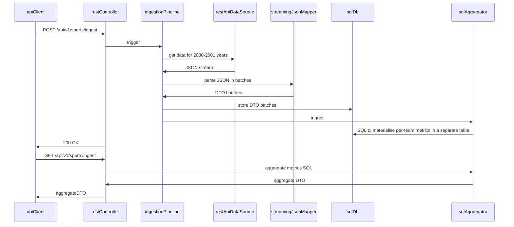

# How to build and run

## Prerequisites
1. Docker daemon and Docker Compose CLI.
2. JDK 23 or 24
3. PowerShell 7.4.13+

## Building
Build, test, and analyse the code: `./gradlew build`.

## Application components overview
Modules overview
- `team-sport-events-model` - a library module containing the data models for the data to be ingested
- `team-sport-stats-model` - a library module containing the data models for the data aggregations
- `ingestion-engine` - a library Spring Boot module with the core abstractions for data ingestion and transformation + implementations based on REST API data source and PostgreSQL aggregation storage.
- `rest-api` - a Spring Boot application that instantiates the `ingestion-engine` and exposes two REST API endpoints:
  - `POST /api/v1/sports/ingest` - initiate (re)ingestion from two predefined REST API data sources and pre-computation of some aggregations
  - `GET /api/v1/sports/aggregate` - query the data aggregations on the ingested team match history

Why PostgreSQL?
- Main rationale is that it's convenient to bring up a local Docker container with this DB. What's more important, NeonDB offers a reasonable free-tier
for a small PostgreSQL cluster in the cloud with minimal configuration.

Ingestion/aggregation flow:


Key points:
- The overall dataset may be quite large. So, we separate the ingestion and aggregation processes.
- Also, we pre-compute some metrics grouped by teams to speed up subsequent analytical queries.
- The input JSON files may be huge, so we avoid materialising the whole JSON stream in memory. Instead, we parse it using Jackson Streaming API, accumulate
moderate DTO batches, and forward the batches to the SQL DB.
- Key points in the code are covered with logs for troubleshooting.
- Both the REST API and SQL integrations are configured with finite timeouts to avoid hanging up in the event of network and other issues.

## Running locally

### Local deployment of the application

1. Build the project with `./gradlew build`.
2. In your IDE
    - Locate the `org.bananalaba.springcdtemplate.web.LocalRunner` class (in the `rest-api/src/integrationTest/java` folder).
    - Create a Java app run configuration based on `DockerOnlyRunner` inside the `LocalRunner`.
    - Configure some env variables for the run configuration
      - `ENABLE_AUTH=false`
      - `logging.file.enabled=false`
      - `SOCCER_API_BASE_URL=https://jnfue27hgezyex5k7aniuvzqiu0hshdq.lambda-url.eu-central-1.on.aws`
3. Trigger the IDE run configuration above: this will run the application with a minimal setup with a transient Docker container for PostgreSQL.

### Local monitoring stack (optional)

0. **One-time setup**
    1. Create a `local-infrastructure/env/docker/.env` file with the following properties:
   ```
    KIBANA_SYSTEM_PASSWORD=<some password>
    ELASTIC_PASSWORD=<some password>
    LOGSTASH_INTERNAL_PASSWORD=<some password>
    FILEBEAT_INTERNAL_PASSWORD=<some password>
    BEATS_SYSTEM_PASSWORD=<some password>
    ELASTIC_VERSION=8.7.1
   ```
    2. Open a terminal/shell in the `local-infrastructure` folder.
    3. Run `local-infrastructure/manage-env.ps1 setup` - this will deploy ElasticSearch 8 + Kibana 8 + Jaeger all-in-one for monitoring.
    4. Change the env variables for the `DockerOnlyRunner` (see the local deployment steps above).
      - `logging.file.enabled=true`
      - `ENABLE_TRACING=true`
1. From the `local-infrastructure` folder
    1. Run `manage-env.ps1 start`.
    2. Run `manage-app.ps1 start`.
    3. Use `http://localhost:8080` to interact with the application.
    4. Use `http://localhost:5601` to search logs in Kibana (authorise as `elastic` with ELASTIC_PASSWORD).
    5. Use `http:localhost:16686` to search traces in Jaeger.
2. Other commands
    1. `manage-env.ps1 recreate` - delete the application and monitoring containers, and create the monitoring containers from scratch
    2. `manage-env.ps1 destroy` - delete the application and monitoring containers
    3. `manage-env.ps1 stop` - stop the application and monitoring containers
    4. `manage-app.ps1 stop` - stop the application container
    5. `manage-app.ps1 destroy` - stop and remove the application container
